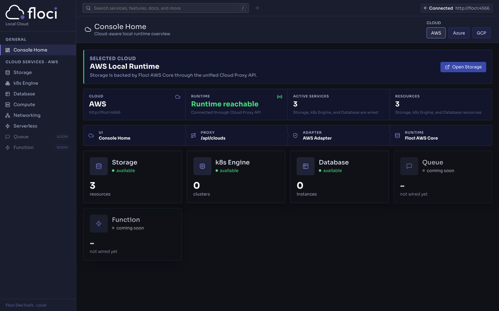

<p align="center">
  
  
</p>

<p align="center">
  <strong>Any Cloud. Locally.</strong><br />
  A local-first, cloud-aware runtime console for Floci and compatible local cloud emulators.
</p>

<p align="center">
  <a href="https://github.com/floci-io/floci-ui/releases/latest"></a>
  <a href="https://github.com/floci-io/floci-ui/actions/workflows/ci.yml"></a>
  <a href="https://hub.docker.com/r/floci/floci-ui"></a>
  <a href="https://hub.docker.com/r/floci/floci-ui"></a>
  <a href="https://opensource.org/licenses/MIT"></a>
</p>

<p align="center">
  
</p>

Floci UI is the web console for the Floci ecosystem. The current app is centered on a unified `Cloud Explorer` and a cloud-aware `Console Home`. It renders only real data returned by local runtimes and explicit placeholders for work that is not wired yet.

No fake resources, no demo rows, and no mock operational data are shown in normal mode.

## Quick Start

AWS-only stack:

```bash
docker compose up
```

Full multi-cloud stack:

```bash
docker compose --profile multicloud up
```

Open [http://localhost:4500](http://localhost:4500).

## What The UI Actually Exposes Today

This table is the source of truth for the current UI surface.

| Surface | AWS | Azure | GCP | Notes |
|---|---|---|---|---|
| Console Home | Yes | Yes | Yes | Cloud-aware overview page with runtime status and service cards. |
| Cloud Explorer / Storage | Yes | Yes | Yes | Unified storage view with resource table, inspector, object browser, and schema-driven actions. |
| Cloud Explorer / k8s Engine | Yes | Placeholder | Placeholder | AWS EKS list/inspect is wired. |
| Cloud Explorer / Database | Yes | Yes | Placeholder | AWS RDS list/inspect and Azure Cosmos DB NoSQL workflows. |
| Cloud Explorer / Compute | Yes | Placeholder | Placeholder | AWS EC2 and AMI workflows. |
| Cloud Explorer / Networking | Yes | Placeholder | Placeholder | AWS VPC/networking workflows. |
| Cloud Explorer / Serverless | Yes | Not exposed in navigation | Not exposed in navigation | AWS Lambda flows through the unified shell. |
| Dedicated page / Secrets Manager | Yes | No | No | AWS-only page outside Cloud Explorer. |

Visible placeholders in the current sidebar:

- Queue
- Function
- Azure compute, networking, and k8s
- GCP non-storage services
- IAM, KMS, Cognito, Systems Manager, ElastiCache

## Current Capability Snapshot

<details>
<summary><strong>Storage</strong></summary>

Cloud Explorer storage is the most complete unified category today.

- AWS S3 buckets are normalized as `storage` resources with type `bucket`.
- Azure Blob containers are normalized as `storage` resources with type `container`.
- GCP Cloud Storage buckets are normalized as `storage` resources with type `bucket`.
- Shared resource table, shared inspector, runtime status strip, and schema-driven create/delete flows.
- Object/blob browser with prefix navigation.
- Upload, download, delete, copy, and create-folder-prefix actions.
- Azure folder markers are hidden and rendered as folders in the browser.
- Size and last-modified metadata are shown when returned by the runtime.

Current gaps:

- No bulk multi-select actions yet.
- No tag/policy/version management in the unified view.
- Folder creation is prefix-based, not a real filesystem directory.

</details>

<details>
<summary><strong>k8s Engine</strong></summary>

AWS only, through the unified shell.

- EKS clusters can be listed and inspected.
- Cluster metadata, node groups, and related details are surfaced when returned by Floci AWS Core.

Current gaps:

- No AKS or GKE adapter yet.
- No generic cluster creation flow in Cloud Explorer.

</details>

<details>
<summary><strong>Database</strong></summary>

Two different database models are currently exposed under one category:

- AWS RDS: list and inspect oriented.
- Azure Cosmos DB NoSQL: database, container, and document workflows.

Cosmos DB currently includes:

- List, create, and delete databases.
- List, create, and delete containers.
- Create, edit, and delete documents/items.
- SQL query editor for documents.

Current gaps:

- No unified cross-provider database contract beyond the shared category shell.
- No GCP database adapter yet.
- AWS DynamoDB is not rebuilt into the new Cloud Explorer model yet.

</details>

<details>
<summary><strong>Compute</strong></summary>

AWS only, through the unified shell plus AWS-specific panels where the workflow is too rich for a flat generic form.

- List EC2 instances and AMIs as normalized resources.
- Launch instances.
- Start, stop, reboot, and terminate instances.
- Create AMIs.
- Edit tags.
- View console output.

Current gaps:

- No Azure VM or GCP compute adapter yet.
- Compute creation still uses an AWS-specific panel because it needs dependent selectors.

</details>

<details>
<summary><strong>Networking</strong></summary>

AWS only, through the unified shell plus an AWS-specific networking panel.

- VPC list and inspect.
- VPC creation and delete.
- VPC wizard.
- Subnets, security groups, internet gateways, NAT gateways, route tables, and Elastic IP workflows.

Current gaps:

- No Azure VNet or GCP VPC adapter yet.
- Advanced multi-cloud networking normalization is still pending.

</details>

<details>
<summary><strong>Serverless</strong></summary>

AWS only in the current navigation.

- Lambda-oriented unified schema is wired through the Cloud Explorer serverless service.
- The backend already exposes serverless through the Cloud Proxy API.

Current gaps:

- Azure Functions is not yet exposed in the left navigation.
- No GCP serverless adapter in the UI surface.
- Old AWS Lambda page is gone; all future work should stay in the unified model.

</details>

<details>
<summary><strong>Secrets Manager</strong></summary>

This is the only dedicated AWS page still outside Cloud Explorer.

- List secrets.
- Inspect metadata.
- Reveal current value on demand.
- Create secrets.
- Update values.
- Delete secrets, including force delete.

Current gaps:

- Not migrated into the Cloud Explorer contract yet.
- No Azure or GCP secret adapter yet.

</details>

## Product Direction

Floci UI is evolving toward a metadata-driven, cloud-aware console where one web app can render multiple local runtimes through the same shell.

The guiding rules are:

- The UI does not know clouds.
- The proxy does not know internal implementations.
- The SPI defines the contracts.
- The adapters perform the translation.
- The runtimes execute the real behavior.

## Architecture


Short implementation notes live in [docs/implementation-notes.md](docs/implementation-notes.md).

## Project Structure

```text
packages/
  api/
    src/
      cloud-spi/
      registry/
      adapter-aws/
      adapter-azure/
      adapter-gcp/
      routes/
      service/
  frontend/
    src/
      api/
      components/
      features/
      pages/
```

High-level runtime flow:

```text
Browser
  -> frontend (React/Vite)
  -> /api/clouds/*
  -> Cloud Adapter Registry
  -> provider adapter
  -> local runtime
```

## Setup

### Docker Compose

Default compose stack:

- `floci-ui` on `http://localhost:4500`
- `floci-api` on `http://localhost:4501`
- `floci` on `http://localhost:4566`

Start AWS-only:

```bash
docker compose up
```

Start AWS + Azure + GCP:

```bash
docker compose --profile multicloud up
```

Convenience targets:

```bash
make up
make up-multicloud
make down
make logs
```

### Manual Local Development

Prerequisites:

- Node.js 20+
- pnpm 9+
- Bun
- A running local runtime: Floci core, and optionally Floci-AZ / Floci-GCP

Install dependencies:

```bash
pnpm install
```

Configure the API environment:

```bash
cp .env.example packages/api/.env
```

Important: the API runs from `packages/api` and loads environment variables from `packages/api/.env`.

Start Floci AWS Core with Docker:

```bash
docker run -d --name floci \
  -p 4566:4566 \
  -v /var/run/docker.sock:/var/run/docker.sock \
  -e FLOCI_DEFAULT_REGION=us-east-1 \
  -u root \
  floci/floci:latest
```

Or from a local clone:

```bash
git clone https://github.com/floci-io/floci.git ../floci
cd ../floci
./mvnw clean quarkus:dev
```

Optional local runtimes:

- Floci-AZ on `http://localhost:4577`
- Floci-GCP on `http://localhost:4588`

Start the UI stack:

```bash
pnpm dev
```

That starts:

- frontend on `http://localhost:4500`
- API on `http://localhost:4501`

Split commands:

```bash
pnpm dev:api
pnpm dev:web
```

## Environment

Default API environment values:

```bash
FLOCI_ENDPOINT=http://localhost:4566
FLOCI_AZURE_ENDPOINT=http://localhost:4577
FLOCI_AZURE_ACCOUNT_NAME=devstoreaccount1
FLOCI_GCP_ENDPOINT=http://localhost:4588
FLOCI_GCP_PROJECT=floci-local
AWS_REGION=us-east-1
AWS_ACCESS_KEY_ID=test
AWS_SECRET_ACCESS_KEY=test
PORT=4501
```

`VITE_MOCK_MODE=false` is kept in `.env.example`, but the current app is intended to run against real local runtimes.

## Verification

```bash
pnpm lint
pnpm type-check
pnpm test
pnpm build
```

## Troubleshooting

### `http proxy error` or `ECONNREFUSED` on `/api/*`

The frontend is up, but the API is not reachable on `http://localhost:4501`.

Check:

```bash
pnpm dev:api
curl http://localhost:4501/api/clouds
```

### `EADDRINUSE` on port `4501`

Another API process is already running. Stop it first or kill the process holding port `4501`.

### Runtime shows `Not connected` or `Runtime unavailable`

Check the runtime directly:

```bash
curl http://localhost:4566/_floci/health
curl http://localhost:4501/api/clouds/aws/status
curl http://localhost:4501/api/clouds/azure/status
curl http://localhost:4501/api/clouds/gcp/status
```

### Credentials or endpoint mismatch

For AWS local development, keep API credentials aligned with the runtime:

```bash
AWS_ACCESS_KEY_ID=test
AWS_SECRET_ACCESS_KEY=test
```

## Contributing

When adding new UI surface:

- Prefer the Cloud Explorer and Cloud Proxy model over new legacy pages.
- Reuse the SPI contracts before creating provider-specific response shapes.
- Keep placeholders explicit instead of inventing fake data.
- Update this README when the visible UI surface changes.

## License

[MIT](LICENSE) — part of the [Floci](https://floci.io) ecosystem.
